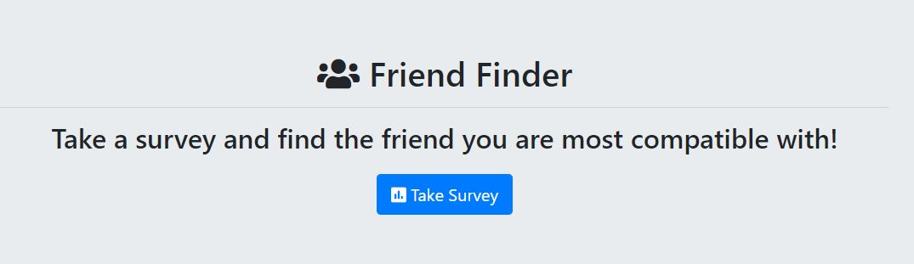
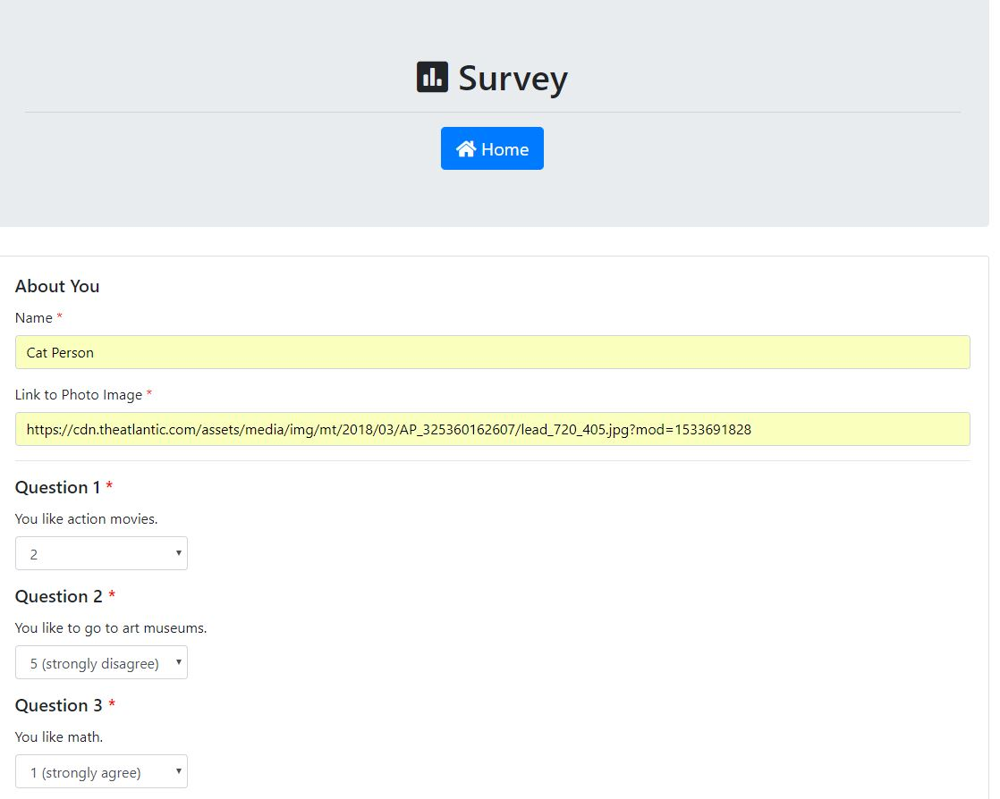
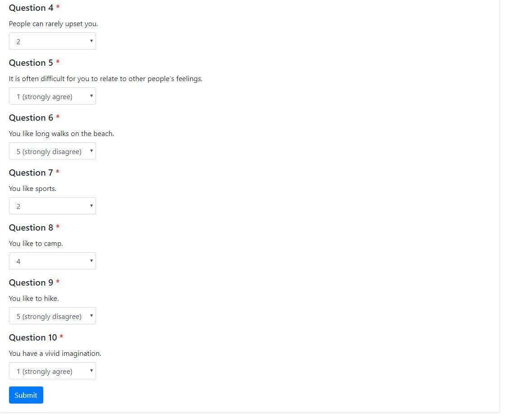
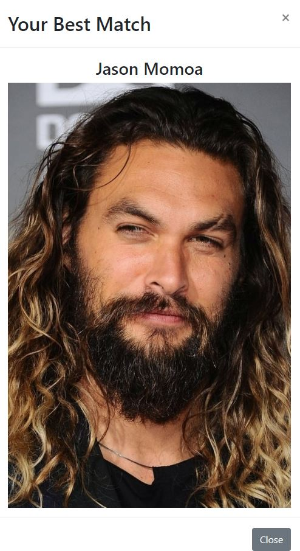
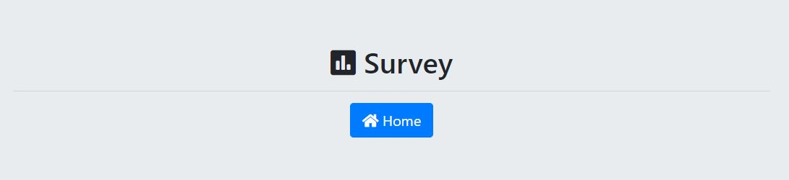

# FriendFinder

This is a full-stack website built with Node, Handlebars, Express, Bootstrap, and JQuery. If the user fills out the survey then it will display a modal popup with the friend they are most compatible with. 

You can find the deployed website [here](https://noel-friend-finder.herokuapp.com/).

## Taking the survey

1. Press the `Take Survey` button on the home screen.

    

2. This will bring you to a new page where you will have to enter your name, provide a link to your profile image and answer a few questions. 

    
    

3. Press the submit button once you have answered all your questions. 

4. A modal will appear displaying your best match. 

    

5. Click ok to close the modal. 
6. You can head back to the home page by clicking the `Home` button at the top of the survey page. 

    

7. At the bottom left of the page you will see links to the `API Friends List` which will send a request to the API to retrieve a list of friends saved in the program and display them back in JSON format. 

8. At the bottom left of the page you will also see a link to the `Github Repo` which will open a new tab in your browser with the github repo page where this code is saved. 